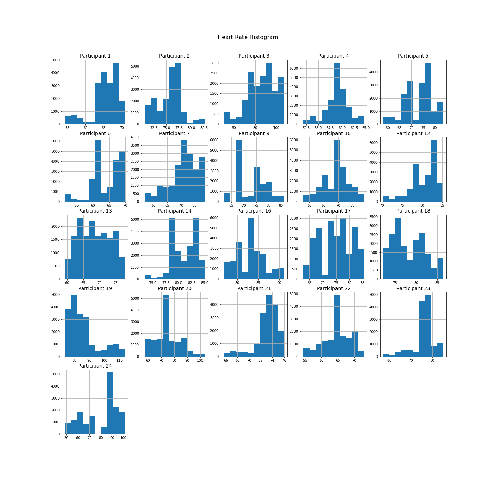
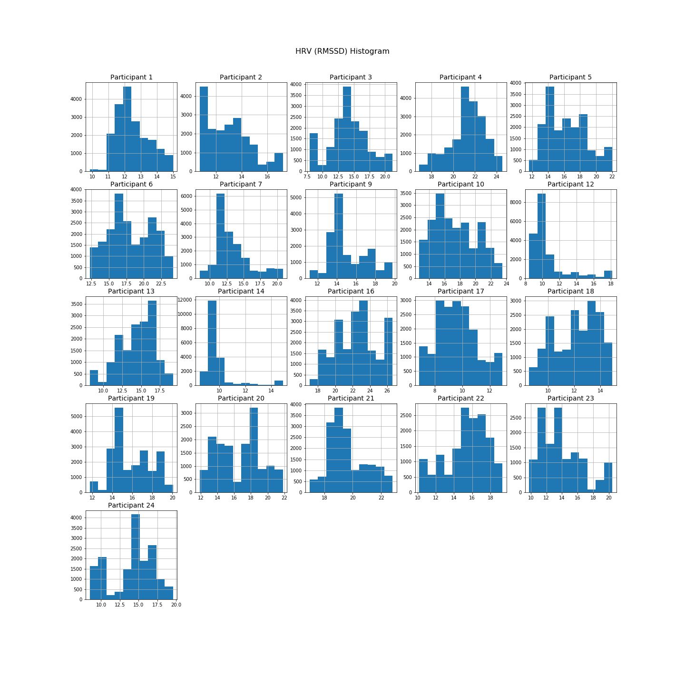
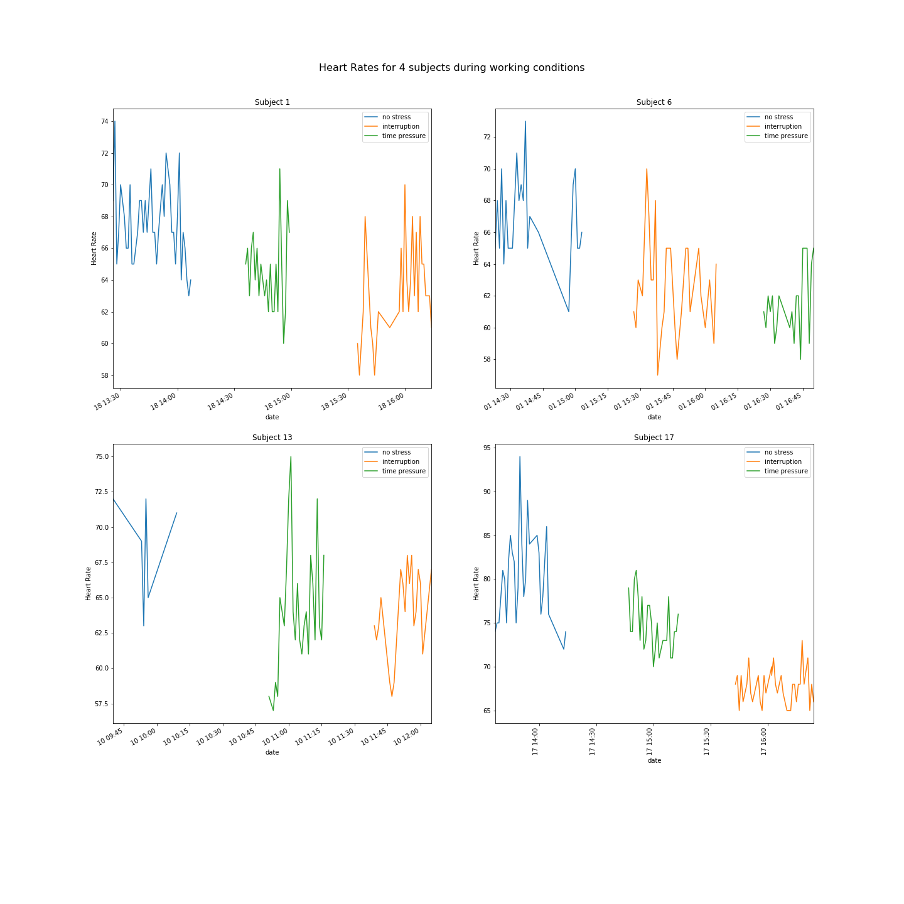
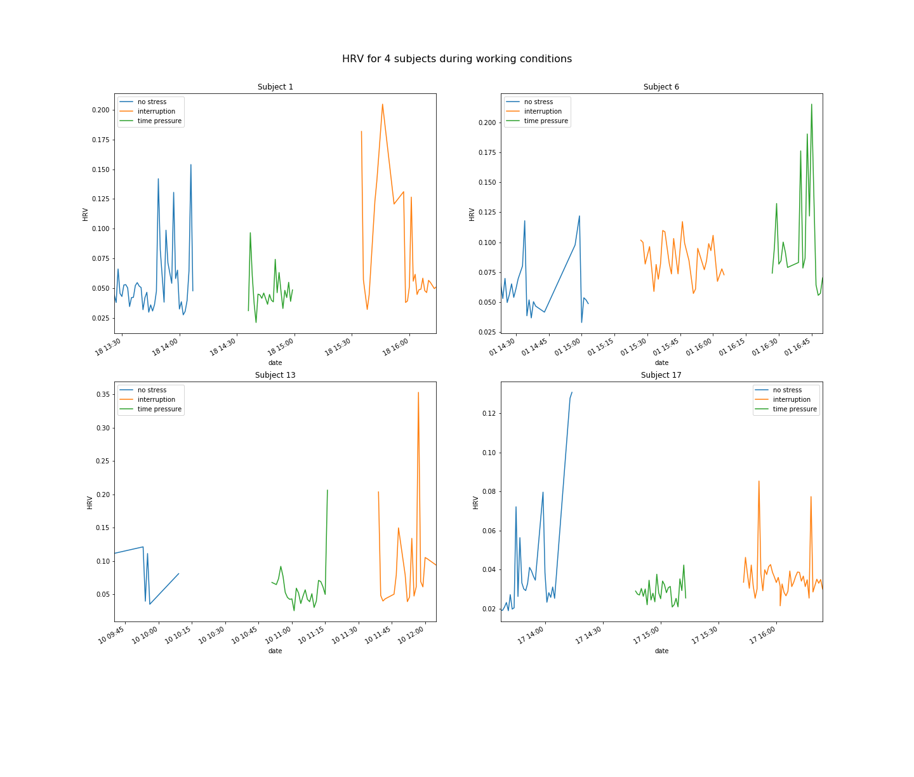
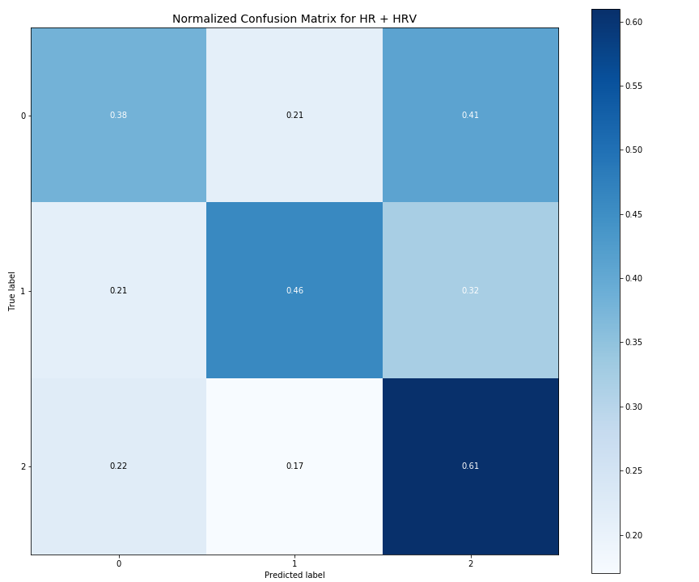
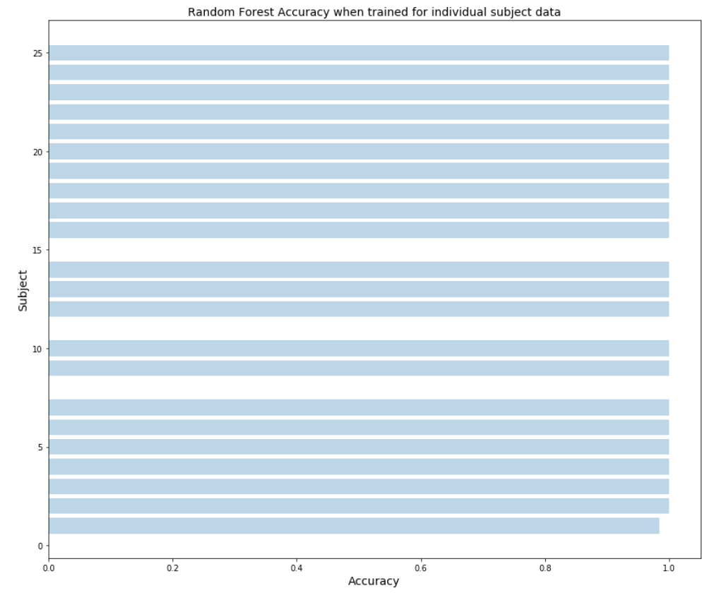
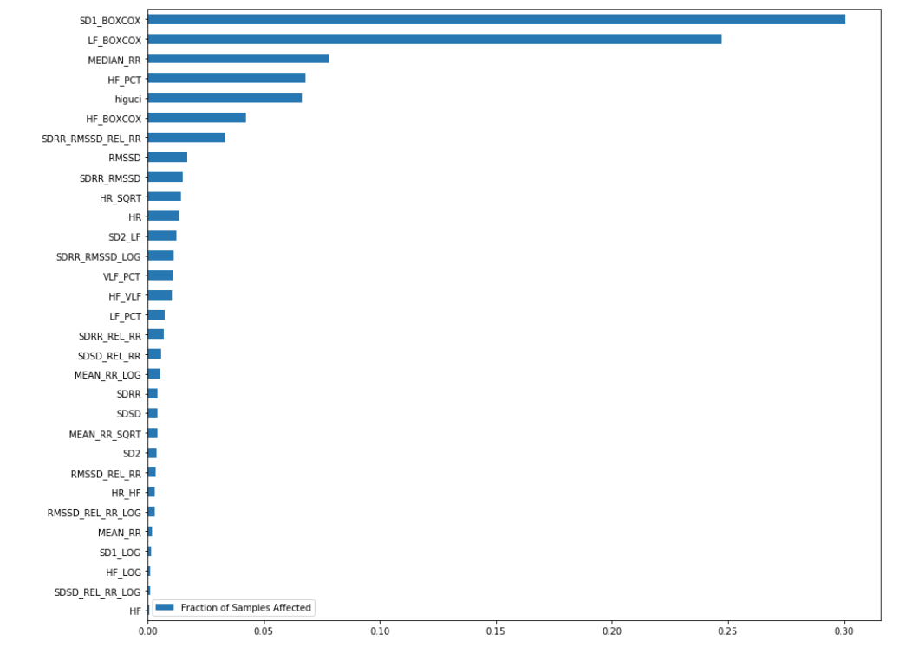
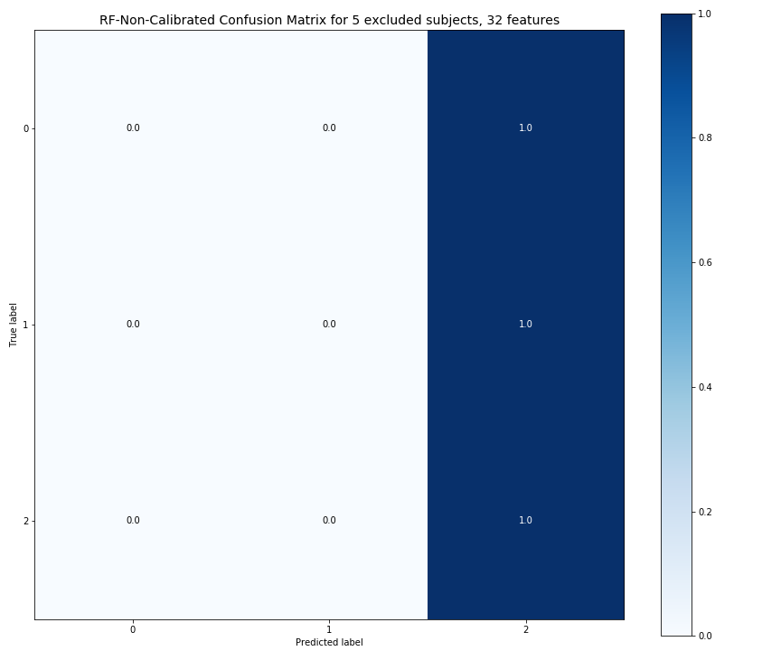
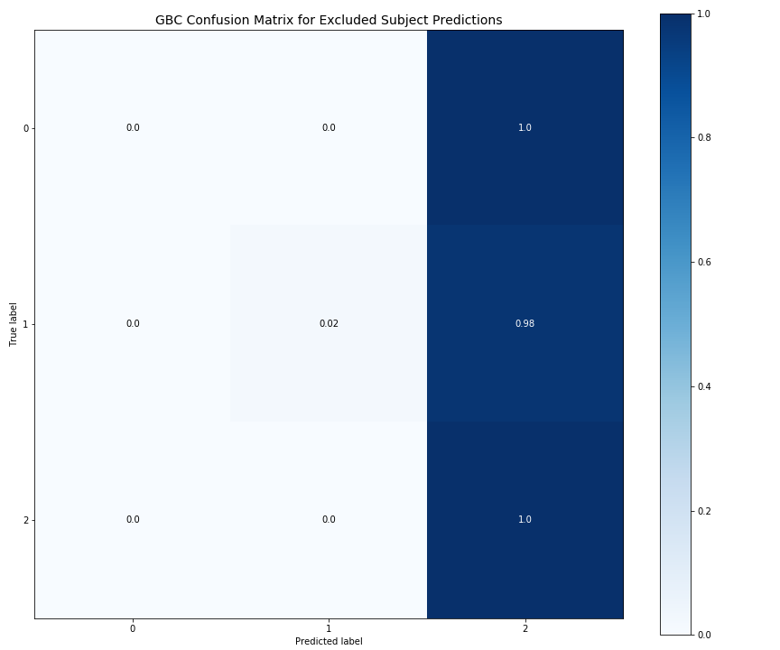

## Predicting Stress from Heart Rate Variability Data

This project was to explore whether heart rate variability data can predict stress. After seeing heart rate variability data being calculated by my fitness tracker, I was interested in interpreting the values and learned that HRV can be used as an indicator of a stressful state. HRV has an inverse relationship with stress in that low HRV can mean higher stress and higher HRV can indicate lower stress ([source](https://www.health.harvard.edu/blog/heart-rate-variability-new-way-track-well-2017112212789)). HRV can be measured as the variance in time between heartbeats for a specific interval. A more detailed definition can be found in this [resource](https://www.heartmath.org/research/science-of-the-heart/heart-rate-variability/).

I came across a research paper on the subject (["The Effect of Person-Specific Biometrics in Improving Generic Stress Predictive Models"](https://www.health.harvard.edu/blog/heart-rate-variability-new-way-track-well-2017112212789)) which did an analysis of stress prediction using the dataset from the SWELL experiment in 2012. The SWELL dataset involved 25 subjects undergoing activities that were categorized as "no stress", "time pressure", and "interruption". In addition to other data points, the subjects' heart rate and heart rate variability were calculated during the study. Each subject had approximately 3 hours of data and the researchers provided computed Heart Rate and Heart Rate Variability statistics, including normalized versions of these statistics using sophisticated techniques beyond my understanding. 3 subjects were not included due to missing data.

In addition, the subjects' own interpretation of their stress level was calculated from a questionnaire (Nasa TLX) taken after these activities, and the score was then mapped to 0, 1, 2 (low, medium, high). These scores were used as a measure of stress and cognitive workload. This is detailed more in-depth in the paper referenced above. The datasets included for this analysis are from the following Kaggle links:

[SWELL dataset](https://www.kaggle.com/qiriro/swell-heart-rate-variability-hrv)

[Biometrics for stress monitoring](https://www.kaggle.com/qiriro/stress)

### Goal

The primary goal was to determine if HR and HRV, along with computed statistics could be predictive of a subject's self-reported stress score. Specifically, I was interested in exploring similar questions from the research paper as to whether a general model could be created to predict stress using HR and HRV data.

Given the nonlinear nature of heart rate data, I focused on using Random Forest and Gradient Boosting Classification techniques.

### Dataset

The researchers provided multiple datasets in processed and unprocessed formats. The unprocessed dataset consisted of 1 minute data points for each participant. The unprocessed dataset was missing the Nasa TLX scores and computed features. The datasets with computed HR and HRV statistics, appeared to be generated from the raw ECG signal of the subjects, and had a richer set of features.

The processed dataset also included the Nasa TLX labels, used for the classification models in this project. In addition, given the guidance provided in the dataset summaries, better results could be generated from the richer dataset. The researchers provided a train, validation, and test dataset. For this analysis, I combined all datasets resulting in 18,000 data points per subject and split with Sklearn's test, train split. Grid Search cross validation was used for training, though I kept max_depth parameters low at 2/3 to minimize variance in results. Total estimators was set to 100/250 for efficiency in this project.

### EDA

Histograms of HR and HRV for the participants indicate that there are significant differences in the distributions of HR and HRV data among subjects.

The charts below showing HR and HRV across time in the three different condition states show significant variance in HR and HRV among the different experiment states. However, we do see patterns in these values for each condition state, indicating that HR and HRV may have predictables ranges for the different states.

In general, these charts highlight the fact that HR and HRV values can differ greatly for any given subject and creating a general model across participants is likely to be difficult.

### Classification

I initially started with the approach of determining how a Random Forest would perform with just HR and HRV features for the full set of the subjects. The accuracy score was 0.4853947502808702

Running a Random Forest with HR and HRV trained just for each individual subject resulted in accuracy scores close to 1 for each subject.

Clearly the model performs better on individual subjects, but the high scores for individual participants are likely a result of the data points for HR and HRV being highly correlated for the 3 experiment conditions. There does seem to be a clear pattern in differences of these values for various conditions.

Given the strong variance in data among subjects, it's clear that a generalized model would not work well for a new set of subjects. I changed my approach to exclude 5 subjects from the data for training a new model and testing the model on both included and excluded sets of subjects. For efficiency reasons, I included 32 computed features based on an initial Random Forest that was run, including about half of the most important features.

<strong>Accuracy Score for included subset:</strong> 0.7267839333978927

LF Box Cox was the most important feature for the model training on include subjects This is the normalized low-frequency band of the power of HRV. Papers in the Kaggle links shed more light on these computations and this is definitely not my area of expertise.

For the excluded subset, the Random Forest performed quite poorly and predicted a label of 2 for all subjects resulting in an
accuracy score of 0.2824691682548027 for the excluded subset. Further analysis is required to determine if this is due to a class imbalance between the train and test set or a skewed pattern in the model.

Given the poor results on the excluded subset, I tried an idea based on the research paper to calibrate the training dataset with a sample of data points from the excluded subset. I added a random sample of 1000 data points for each subject in the excluded set, or approximately 5.5% of the data for each subject.
The idea behind the calibration method was to emulate an approach of a subject providing some readings of HR and HRV, in addition to questionnaire responses before training a model.

Accuracy scores seem to drop slightly to .2619539706449014 indicating that the calibration did not have much of an effect.

The next step was to try a completely new model in Gradient Boosting along with the calibration technique. Results were better with Gradient Boosting:

- <strong>Accuracy Score for included subset:</strong> 0.9992339601370199
- <strong>Accuracy Score for excluded subset:</strong> 0.5506081250831276

Gradient Boosting, with a combination of weak learners, can have less variance than Random Forest, and often lead to better results.

Reasoning through this, even if results were better, given that HR and HRV data points are sequential in time series format, the calibrated data added to the training set for the included subject is correlated to the test data for the excluded set. The “calibrated” approach needs to be tested using independent data from another set of trials to determine whether it can successfully be used in a generalized model.

#### Overall Findings

- Using individual models for a subject, HR and HRV may have predictive capability for conditions of stress or no-stress based on the SWELL dataset. However, this would need to be confirmed with additional independent trials given the short 3 hour span of each experiment and correlation in values
- A generalized, non-linear model with HR and HRV, even with computed features that normalize these values, does not have predictive capability for individual subjects and may perform worse than a random prediction
- Using HR and HRV for stress prediction is worth more exploration if effective data can be compared among independent trials

